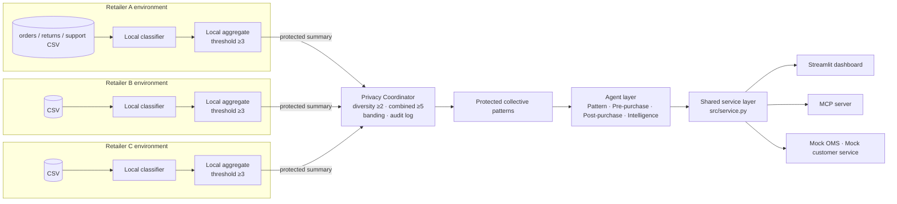

# Distributed Returns Optimization Agent

> One-day capstone prototype. **All data is synthetic and fictional.** Privacy is demonstrated with thresholds and banding. It is **not** production-grade differential privacy or cryptography.

## 1. Project overview

Three simulated retailers analyse their product returns **locally**. Each one shares only small, protected summaries with a central privacy coordinator. The coordinator releases a pattern only when several retailers share it, and it never releases exact counts. Four agents turn those protected patterns into pre-purchase fixes, post-purchase support drafts and forecast scenarios. They are available through a Streamlit dashboard and an MCP server.

Everything runs offline. No LLM, API key or paid service is needed.

## 2. Business problem

Retailers see the same return reasons again and again:
- clothing that doesn't fit
- incompatible accessories
- unclear dimensions
- items that look different from the listing
- confusing setup
- damaged or late deliveries

Retailers could learn from each other. However, they cannot expose any of the following:
- customer data
- order-level data
- exact return rates
- poorly performing products
- internal service strategies

## 3. Main use case

> *"Compatibility is a strong return driver for Electronics across a broad group of retailers. A compatibility checker could reduce avoidable returns."*

The system produces insights like that one. It never produces statements like *"Retailer A has a 25% electronics return rate."*

## 4. Architecture



**Architectural rule:** the privacy coordinator never opens a CSV. Each `RetailerNode` loads only its own directory and exposes `get_protected_summary()`, and the coordinator calls that method.

The nodes are simulated in this prototype as separate Python objects with separate data directories, all running in one process. In production, each node would run inside its own retailer's environment, and only protected summaries would cross the network.

## 5. The four agents

| Agent | Responsibility |
|---|---|
| **ReturnPatternAnalysisAgent** | Requests patterns through the coordinator. It returns the approved ones, filters by category, cause or signal, ranks by signal band (never by count), and writes a short explanation. |
| **PrePurchaseInterventionAgent** | Maps an approved cause to shopping-experience fixes: name, description, effort, expected impact, placement and guardrails. |
| **PostPurchaseSatisfactionAgent** | Maps a cause to support actions with channel and satisfaction impact. Every action is a **draft that needs human approval**. |
| **ReturnsIntelligenceAgent** | Loads and searches `knowledge/interventions.json`. It supplies cause descriptions, interventions, forecast assumptions, experiments, risks and guardrails. |

## 6. Privacy approach

| Rule | Control |
|---|---|
| **A. Local threshold** | A retailer contributes a category-and-cause pattern only if it has ≥ 3 local records. Below that, it sends only the key and `threshold_passed=false`, with no count. |
| **B. Retailer diversity** | A pattern is released only if ≥ 2 retailers contribute. |
| **C. Collective threshold** | Combined eligible records must be ≥ 5. |
| **D. Banded output** | Signal is Emerging (5–7), Medium (8–14) or High (15+). Contributors are Multiple (2) or Broad (3+). |

Further protections:
- **Allowed fields only.** Public output contains only `category`, `cause`, `signal_strength`, `contributor_band`, `confidence` and `privacy_status`. The Pydantic models use `extra="forbid"`, and `assert_public_safe()` rejects any restricted field.
- **Temporary tokens.** Retailer tokens are regenerated on every summary call and never released.
- **Audit log.** Every evaluation is logged as APPROVED or SUPPRESSED, with a reason and the rule applied. Logs contain no counts and no identities.

Note that rule C can only fire on its own if rules A and B are relaxed. With A = 3 and B = 2, any pattern that passes both already has at least 6 records. Rule C is implemented and tested independently anyway.

## 7. MCP

`mcp_server.py` uses the official Python MCP SDK (`FastMCP`) over stdio. It exposes 15 tools, 2 resources and 1 prompt. The 8 core tools are listed below, and the 7 extended tools are in the table under section 7. Every tool calls the shared service:

| Tool | Purpose |
|---|---|
| `analyze_return_patterns` | Approved patterns, with optional category and signal filters |
| `get_pattern_details` | Explanation plus banded evidence |
| `recommend_pre_purchase` | Pre-purchase interventions |
| `recommend_post_purchase` | Post-purchase drafts |
| `forecast_intervention_impact` | Low, expected and high projection, with a warning |
| `get_sanitized_order_context` | The 4 allowed order fields for a local demo order |
| `create_support_intervention_draft` | DRAFT only; human approval required |
| `get_privacy_audit_summary` | Audit events with no counts or identities |

> **MCP standardizes access to tools; privacy is enforced by the application's thresholding and output controls.**

### Extended features

| Feature | Where | What it adds |
|---|---|---|
| **Classification Lab** | Tab 6 · `classify_return_text` | Try any comment and see the matched keywords, rule and confidence. The text is processed in memory only. |
| **Category × cause signal map** | Tab 2 · `get_category_cause_matrix` | Heatmap of banded signals. Suppressed cells stay blank. |
| **Prioritisation matrix** | Tab 3 · `prioritize_interventions` | Impact-vs-effort quadrants: Quick win, Strategic bet, Consider, Deprioritise. |
| **Portfolio forecast** | Tab 4 · `forecast_intervention_portfolio` | Bundle up to 6 interventions. Overlapping effects combine as 1 − ∏(1 − pᵢ) instead of being summed, and the overlap adjustment is shown. |
| **Privacy policy simulator** | Tab 5 · `simulate_privacy_policy` | Shows which patterns survive a **stricter** policy. It can't go below the 3 / 2 / 5 floor, and it releases and logs nothing. |
| **Knowledge-base search** | Tab 3 · `search_knowledge_base` | Keyword search over all interventions. |
| **Exports** | Tabs 2, 3, 5 | Banded patterns as CSV, implementation plan as Markdown, audit log as CSV. None contain counts or identities. |
| **Draft queue** | Tab 4 · `list_support_drafts` | Every draft created this session. All are DRAFT, and no customer has been contacted. |
| **MCP resources & prompt** | `returns://taxonomy`, `returns://privacy-policy`, prompt `returns_review` | Lets an assistant load the rules and run a guided review. |

## 8. Project structure

```
distributed-returns-optimizer/
├── app.py                  Streamlit dashboard (6 tabs)
├── mcp_server.py           FastMCP server (15 tools, 2 resources, 1 prompt)
├── generate_data.py        Deterministic synthetic data (seed 42)
├── check_mcp.py            End-to-end MCP client check (PASS/FAIL for every tool)
├── requirements.txt · README.md · PRESENTATION.md · TEAM_TASKS.md · .gitignore
├── data/retailer_{a,b,c}/  orders.csv · returns.csv · support_cases.csv
├── knowledge/              cause_taxonomy.json · interventions.json
├── src/
│   ├── models.py           Pydantic contracts and restricted-field list
│   ├── classifier.py       Keyword classifier
│   ├── forecasting.py      Assumption-based forecasts
│   ├── audit.py            In-memory privacy audit log
│   ├── service.py          Shared facade for UI and MCP
│   ├── retailer_nodes/     RetailerNode
│   ├── privacy/            local_privacy.py (rules) · coordinator.py
│   ├── agents/             pattern · prepurchase · postpurchase · intelligence
│   └── integrations/       mock_oms.py · mock_customer_service.py
└── tests/                  classifier · privacy · forecasting · integrations · service · features
```

## 9. Installation

```bash
python -m venv .venv
# Windows
.venv\Scripts\activate
# macOS/Linux
source .venv/bin/activate

pip install -r requirements.txt
```

## 10. Data generation

```bash
python generate_data.py
```

This regenerates `data/retailer_a|b|c/` from a fixed seed. Each retailer gets 100 orders, 64–65 returns and 40 support cases. The CSVs are already committed, so this step is optional.

The data includes these planted scenarios:
1. Electronics COMPATIBILITY at all 3 retailers → **High / Broad**
2. Footwear sizing at 2 retailers → approved
3. Setup difficulty at several retailers → approved
4. Furniture damage at 2 retailers → approved
5. Beauty allergy/sensitivity (OTHER) only at Retailer A → **suppressed** (diversity)
6. Sports damage and Electronics delivery issues, each with fewer than 5 records → **suppressed**
7. Dimension and expectation mismatches → intervention examples

## 11. Run Streamlit

```bash
streamlit run app.py
```

## 12. Run MCP

```bash
python mcp_server.py
```

The server speaks MCP over stdio, so it waits for a client on stdin. To connect, register it in an MCP client such as Claude Desktop or Claude Code:

```json
{ "mcpServers": { "returns": { "command": "python", "args": ["mcp_server.py"], "cwd": "<path to this folder>" } } }
```

**Check every tool from the command line.** This script acts as a real MCP client: it starts the server, calls all 15 tools, both resources and the prompt, checks the results and privacy guards, and prints PASS or FAIL for each.

```bash
python check_mcp.py            # add --verbose to see every response
```

**Interactive testing with the MCP Inspector.** This needs Node.js. Start it with the server attached:

```bash
npx @modelcontextprotocol/inspector python mcp_server.py
```

If an Inspector is already open, connect it in the browser instead. Set **Transport** to `STDIO`, **Command** to the full path of `python`, and **Arguments** to the absolute path of `mcp_server.py`, then click **Connect**. Paths are resolved from the file's location, so the working directory doesn't matter.

`mcp dev mcp_server.py` also works if the `mcp[cli]` extra is installed. Exact commands depend on the MCP developer tools you have installed locally.

## 13. Run tests

```bash
pytest -q
```

The suite has 71 tests and runs in under a second.

## 14. Demo walkthrough

1. **Overview tab:** show the three connected retailer nodes and the strongest anonymous driver.
2. **Pattern Explorer:** filter to Electronics. COMPATIBILITY is High / Broad, with about 0.90 confidence.
3. **Planner:**
   - Choose Electronics → COMPATIBILITY.
   - Show the pre-purchase fixes: compatibility checker, device-model confirmation, supported-model list.
   - Show the post-purchase actions: compatible replacement, one-click exchange, technical-support routing.
   - Generate a plan.
4. **Forecast:**
   - Run COMPATIBILITY with the compatibility checker on 100 affected returns. The result is Low 12, Expected 20, High 25, all labelled as projections.
   - Create the draft "Recommend compatible replacement". It is created as a DRAFT and needs human approval.
5. **Privacy & MCP:** show the thresholds, the audit events, the blocked Beauty single-retailer pattern, the MCP tools and the fields that are never shared.
6. **Optional extras:**
   - Raise "Minimum retailers" to 3 in the policy simulator. 14 released patterns drop to 9.
   - Build a two-intervention portfolio.
   - Type a comment into the Classification Lab.

## 15. Limitations

- The data is synthetic.
- Classification is rule-based keyword matching, not a trained model.
- Privacy uses thresholds and bands, not differential privacy or secure aggregation. Repeated queries over changing data could still leak information in a real system.
- Forecasts use fictional assumptions. The scaling for lower-impact interventions (Medium × 0.75, Low × 0.5) is also an assumption.
- The OMS and customer-service integrations are mocks.
- All nodes run in one process.
- There is no authentication.

## 16. Future improvements

- Federated learning
- Differential privacy and secure aggregation
- Real OMS and CRM connectors
- Authentication and authorisation
- Feeding experiment results back into the forecasts
- Local LLM classification after redaction

## 17. Team contribution summary

See [TEAM_TASKS.md](TEAM_TASKS.md):

| Member | Area |
|---|---|
| Member 1 | Data and classification |
| Member 2 | Privacy and distributed analytics |
| Member 3 | Agents and forecasting |
| Member 4 | MCP and integrations |
| Member 5 | Dashboard, service integration and docs |
